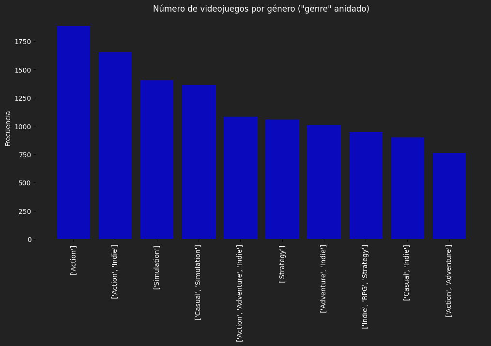

# 
 Proyecto Individual No. 1
# 
 Machine Learning Operations (MLOps)

 Realizado por:

**
 Luis David Rojas Díaz
**

 Estudiante

  

## Descripción del Proyecto

El Proyecto Individual No. 1 está centrado en Machine Learning Operations **(MLOps)**, el cual ha sido concebido con el propósito de analizar y poner en funcionamiento un sistema de recomendación de videojuegos basado en datos de la plataforma Steam. En calidad de Data Scientist, se recibieron tres conjuntos de datos esenciales para la construcción del modelo, los cuales contenían información sobre los videojuegos en steam, tiempo de juego de los usuarios por cada videojuego, y las recomendaciones específicas realizadas por los usuarios para cada juego. Sobre la información recibida también se pide generar 5 funciones (endpoints) para ser consumida por una aplicación (FastApi) y deployada a través de Render.

      

### Datos del proyecto (originales y generados)

| Carpeta        | Tipo      | Nombre              | Formato | Descripción                                       |
|----------------|-----------|---------------------|---------|---------------------------------------------------|
| Original_Data  | Documento | output_steam_games  | json    | Archivo original de videojuegos                   |
| Original_Data  | Documento | australian_user_items | json  | Archivo original de videojuegos por usuario      |
| Original_Data  | Documento | australian_user_reviews | json | Archivo original de Comentarios de usuarios por videojuego |
| Revised_Data   | Documento | Steam_Games         | csv     | Archivo revisado de output_steam_games.json       |
| Revised_Data   | Documento | User_Items          | csv     | Archivo revisado de australian_user_items.json    |
| Revised_Data   | Documento | User_Reviews        | csv     | Archivo revisado de australian_user_reviews.json  |
| Clean_Data     | Documento | Genres_Items        | csv     | Originado del ETL de Steam_Games.csv               |
| Clean_Data     | Documento | SGames_CD           | csv     | Originado del ETL de Steam_Games.csv               |
| Clean_Data     | Documento | UItems_CD           | csv     | Originado del ETL de User_Items.csv                |
| Clean_Data     | Documento | UReviews_CD         | csv     | Originado del ETL de User_Reviews.csv             |
| Data_Queries   | Documento | End1_Developer      | csv     | Generado de SGames_CD.csv para el Endpoint 1      |
| Data_Queries   | Documento | End2_User           | paquet  | Generado de UItems_CD.csv para el Endpoint 2      |
| Data_Queries   | Documento | UReviews_F          | csv     | Generado de UReviws_CD.csv Endpoint 2              |
| Data_Queries   | Documento | End3_Genre_User     | paquet  | Generado de SGames_CD.csv y Genres_items.csv para el Endpoint 3 |
| Data_Queries   | Documento | End4_BestDeveloperYear | csv | Generado de UReviews_CD.csv para el Endpoint 4    |
| Data_Queries   | Documento | End5_Sentimiento    | csv     | Generado de UReviews_CD.csv y SGames_CD.csv para el Endpoint 5 |
| Data_Queries   | Documento | names               | csv     | Generado de SGames_CD.csv para el Modelo de Recomendación |
| Data_Queries   | Documento | similitud           | csv     | Creado a partir del modelo de similitud de coseno  |
| --             | Documento | Diccionario de Datos STEAM | xlsx | Diccionario de los datos originales "Original_Data" |
| --             | Documento | 1. EDA_Datos_Originales | ipynb | Notebook del EDA preliminar                        |
| --             | Documento | 2. ETL              | ipynb   | ETL de los archivos revisados en "Revised_Data"    |
| --             | Documento | 3. EDA_Datos_Limpios | ipynb   | EDA sobre los datos en "Clean_Data"                |
| --             | Documento | 4. Funciones_Endpoints | ipynb | Notebook sobre las funciones de los endpoints      |
| --             | Documento | 5. Modelo_Recomendación | ipynb | Notebook para el modelo de recomendación            |
| --             | Documento | main                | py      | Scripts para FastApi                               |
| --             | Documento | requirements        | txt     | Lista de aplicaciones necesarias para las descargas de librerías en Render |

_Se asigna "--" a los archivos que no se encuentran dentro de ninguna carpeta del repositorio actual._

Debido a la capacidad sobre el tamaño de los archivos que permite GitHub solo se dejan en este proyecto los datos de la carpeta "Data_Queries" que son los ncesarios para los endpoints y el modelo de recomendación. También se dejan todos los notebooks, el script para la FastApi (**main.py**) y los requerimientos de librerías para Render (**requirements.txt**). Los demás archivos están disponibles en el siguiente link:

Dirección de archivos: [_Documentos_](https://drive.google.com/drive/u/0/folders/16DS0VBpu_QNGv1l6Mf9Q0RqZMTWgZpo_)

## Desarrollo del Proyecto

### 1. Análisis Exploratorio de Datos (EDA) Preliminar

La primera fase consistió en un EDA preliminar donde se examinaron los archivos para comprender su estructura, eliminar registros nulos y esbozar transformaciones necesarias. Este paso sienta las bases para las siguientes etapas del proyecto.

Se tomaron los archivos guardados en la carpeta "Original_Data", se creó un dataframe por cada archivo con los datos limpios y se guardó en la carpeta "Revised_Data".

[_ver notebook_ "1. EDA_Datos_Originales.ipynb"](1.%20EDA_Datos_Originales.ipynb)

### 2. Transformación de Datos

Con base al EDA preliminar, se llevaron a cabo transformaciones de los datos, incluyendo la eliminación de nulos e imputación de valores. Se tomó la decisión de no desanidar datos en el archivo de video juegos (Steam_games.csv), porque se consideró necesario para el modelo de recomendación. Esto más adelante se realizó para las funciones, por lo que en el proceso de ETL se guardó el archivo auxiliar con el "id" de cada juego y el genero desanidado (expandido).

Se tomaron los archivos guardados en la carpeta "Revised_Data", se creó un dataframe por cada uno y luego haber limpiado e imputado los datos para luego guardarlos en la carapeta "Clean_Data".

[_ver notebook_ "2. ETL.ipynb"](2.%20ETL.ipynb)

### 3. EDA de Datos Limpios

Con los datos transformados, se realizó un EDA exhaustivo para analizar estadísticas sobre los items más jugados, géneros predominantes, años con más lanzamientos y relaciones entre las tres bases de datos.

En este EDA al contener datos expandidos, se analiza la estructura de los datos en función de la creación de los endpoints y el modelo de recomendación; se documentan las limpiezas posteriores o arreglos que deberías hacerse en la etapa posterior en la creación de las funciones y el modelo de recomendación.

[_ver notebook_ "3. EDA_Datos_Limpios.ipynb"](3.%20EDA_Datos_Limpios.ipynb)

Lo más relevante durante la exploración y análisis de datos radica en la expanción de la columna "genres" dado que esto generaría numerosos registros pero a su vez proporcionaría más exactitud en las fórmulas y el modelo.

Se observó que existían 303 géneros distintos; sin embargo, la columna "genres" por cada "id" (video juego) representaba una lista de múltiples combinaciones de géneros (2.682 formas de combinar los géneros).

Al considerar que estas combinaciones son excesivas, se guarda un nuevo dataframe que relaciona el "id" con los géneros expandidos pasando de tener más de 30 mil registros a más de 85 mil (por la multiplicación de "id" por género).

A continuación podemos observar el top 10 de los generos con más videojuegos (sin desanidar):

  

Luego de expandir los géneros, se revisó la posibilidad de agrupar un top de géneros principales que acumulen el 90% de la información, para reducir el número de géneros. A continuación se muestra el gráfico de pareto que nos permite concluir que esto es posible:

  

| Genre         | Indie | Action | Casual | Adventure | Simulation | Strategy | RPG  | Free to Play | Early Access | VR   | Sports | Racing |
|---------------|-------|--------|--------|-----------|------------|----------|------|--------------|--------------|------|--------|--------|
| cumulative %         | 20.05 | 34.59  | 45.30  | 55.66     | 64.29      | 72.67    | 79.24| 81.83        | 84.10        | 86.11| 87.92  | 89.32  |

El gráfico nos muestra una acumulación de videojuegos en un número reducido de géneros, lo cual se considera relevante y se concluye se deben agrupar los géneros que reprentan menos del 10% de los datos en un nuevo género "Others".

  

El número de géneros puede reducirse a 11 variables incluyendo uno nuevo "Others" donde se almacena la información del 10% restante.

Este datafrome es almacenado en la carpeta de "Data_Queries" y es sobre el cual se trabaja el modelo de recomendación. Este archivo se creó desde el paso anterior "ETL".

Una conclusión final es que al expandir los datos vemos que el género con más videojuegos es "Indie" mientras que con los datos sin expandir se percibía como género más relevante "Action".

podemos revisarlo en esta nube de palabras:

  

### 4. Funciones para Endpoints de la API

Se desarrollaron funciones para los endpoints de la aplicación FastAPI utilizando consultas específicas para garantizar la eficiencia y optimización del tamaño de los archivos en GitHub. Se llevaron a cabo pruebas de ensayo y error para superar las limitaciones de tamaño de archivos en GitHub.

para ver el desarrrollo en la creación de funciones [_ver notebook_ "4. Funciones_Endpoints.ipynb"](4.%20Funciones_Endpoints.ipynb)

Descipción de funciones:

### 4.1. Función de Registro por Desarrollador

def developer_stats( developer : str ): recibe el nombre de un desarrollador y devuelve la cantidad de items y porcentaje de contenido Free por año según empresa desarrolladora.

Ejemplo de retorno:
| Año  | Cantidad de artículos | Contenido Gratis |
|------|------------------------|-------------------|
| 2023 | 50                     | 27%               |
| 2022 | 45                     | 25%               |
| xxxx | xx                     | x%                |

### 4.2. Función de datos de usuario

def userdata(User_id: int): Debe devolver cantidad de dinero gastado por el usuario, el porcentaje de recomendación en base a reviews.recommend y cantidad de items.

Ejemplo de retorno: {"Usuario X" : us213ndjss09sdf, "Dinero gastado": 200 USD, "% de recomendación": 20%, "cantidad de items": 5}

### 4.3. Función de mejor usuario por género de video juego

def UserForGenre(genero: str): Debe devolver el usuario que acumula más horas jugadas para el género dado y una lista de la acumulación de horas jugadas por año de lanzamiento.

Ejemplo de retorno: {"Usuario con más horas jugadas para Género X" : us213ndjss09sdf, "Horas jugadas":[{Año: 2013, Horas: 203}, {Año: 2012, Horas: 100}, {Año: 2011, Horas : 23}]}

### 4.4. Función de top 3 mejores desarrolladores por año

def best_developer_year(año: int): Devuelve el top 3 de desarrolladores con juegos MÁS recomendados por usuarios para el año dado. (reviews.recommend = Verdadero y comentarios positivos)

Ejemplo de retorno: [{"Puesto 1" : X}, {"Puesto 2" : Y},{"Puesto 3" : Z}]

### 4.5. Función percepción por desarrollador

def desarrollador_reviews_analysis(ReviewsDeveloper: str): Según el desarrollador, se devuelve un diccionario con el nombre del desarrollador como llave y una lista con la cantidad total de registros de reseñas de usuarios que se encuentran categorizados con un análisis de sentimiento como valor positivo o negativo.

Ejemplo de retorno: {'Valve' : [Negative = 182, Positive = 278]}

### 5. Creación del Modelo de Recomendación

Inicialmente se creó el modelo de la tabla SGames_CD sin expandir géneros, dado que la similitud de coseno igual haría una concatenación entre las diferentes variables de la tabla. pero debido que esta concatenación usaría una repetición amplia de los géneros, al final se decide unsar el modelo con géneros expandidos.

se puede obsevar el modelo con los datos de género anidados probado en el notebook "5. Modelo_Rec_Opc1.ipynb" en el siguiente [_enlace_](https://drive.google.com/drive/u/0/folders/16DS0VBpu_QNGv1l6Mf9Q0RqZMTWgZpo_).

Se creó un modelo de recomendación basado en similitud de coseno, utilizando una matriz de coseno sobre los datos del archivo SGames_CD.csv. y Genres_Items. El modelo identifica para un "id" seleccionado los "ids" (video juegos) que más se parecen (se limita a un top 5 de los más parecidos). A continuación los paso para el desarrollo del modelo:

- Eliminación de registros nulos en las columnas relevantes para el modelo en ambas tablas.
- Expanción de la columna "genres" en "Genres_Items".
- Eliminación de las columnas innecesarias de la tabla SGames_CD.
- Transformación de la columna "specs" (de la tabla SGames_CD) en cadena para facilitar la lectura de modelo (quitar la lista de datos anidados).
- Eliminación de comillas, corchetes, comas y reemplazar guiones por espacios en la columna "genre".
- Unir las tablas transformadas.
- Normalización de las columnas numéricas.
- Cocatenación de columnas normalizadas con categóricas.
- Cálculo de la similitud de coseno (creción de matrix).

Al obtener la matrix de similitud de coseno, se creó un nuevo datafrome donde se tenía la lista de lo videojuegos y sobre esta se iteró el modelo para obtener por cada item en una columna, la lista de los "ids" más parecidos que serían los recomendados según el ítem específico. El archivo se guardó en la carpeta "data_Queries" con el nombre de "similitud". Se guardó otro archivo auxiliar con el "id" y nombres de video juegos, para crear una fórmula. 

La fórmula es def obtener_nombres_recomendados(id_seleccionado:int). Esta recibe como entrada un "id" de video juego para obtener como resultado la lista de los 5 que se recomiendan según este "id".

ejemplo de salida:

{'juego_seleccionado': 'Real Pool 3D - Poolians',
    'juegos_recomendados': 
        ['Fantasy Grounds - Mini-Dungeon #023: The Aura of Profit (5E)',
        'One Hit KO',
        'Hack_me 2 - Wallpapers',
        'Trimmer Tycoon',
        'Rocksmith® 2014 – 2010s Mix Song Pack']}

[_ver el desarrollo del modelo en el notebook_ "5. Modelo_Recomendación.ipynb"](5.%20Modelo_recomendación.ipynb)

### 6. Implementación de FastAPI y Despliegue en Render

Se crearon archivos de FastAPI, se realizaron pruebas locales en un entorno virtual y finalmente se desplegó el modelo a través de Render, permitiendo el acceso a través de la web.

Las funciones creadas para los endpoints de FastApi y el modelo de recomendación se transformaron a la estructura necesaria para la lectura de la aplicación durante el entorno virtual de manera local. Se realizaron pruebas hasta garantizar que todas las funciones corrían en FastApi para proceder al despliegue en Render.

En Render se realizan decenas de pruebas corrigiendo escritura de algunas funciones y sobre todo en las direcciones de los archivos para lograr que finamente funcionara la aplicación en la web.

Para el desarrollo se siguieron los pasos del tutorial en el siguiente link: [_tutorial FastApi y Render_](https://github.com/HX-FNegrete/render-fastapi-tutorial)

Los pasos resumidos son:

- Creación un entorno virtual (para probar FastApi)
- Creación un script llamado main.py donde se consignan todas las funciones e importaciones de librerías necesarias para la ejecución de las fórmulas, incluyendo la aplicación FastApi. [_Ver archivo main.py_](main.py)
- Creación la lista de requerimientos de librerías necesarias para correr las funciones. [_Ver archivo requirements.txt_](requirements.txt)
- Creación de un repositorio público en GitHub (este repositorio).
- Sincronización del repositorio local al repositorio de GitHub.
- Creación de una cuenta en Render (render.com).
- Conexión del servicio al repositorio en GitHub.
- Creación de servicio web en Render.
- Ingreso al enlace para consumir la Api en la web.

Para consumir la aplicación en la web y probar las diferentes funciones ingrese al siguiente enlace: [_Dirección API_](https://ldavidrd.onrender.com/docs#/)

### 7. Video explicando el funcionamiento de FastApi deployado con Render

Se crea un video que explica el funcionamiento de la Api deployada mostrando el uso de cada uno de los endpoints directamente en servicio web. Link de video a continuación:

 [_link Video_](https://www.youtube.com/watch?v=_j6DSmWJMyI)

 Si no sirve el link, puede descargar el video en la misma direccion de drive donde se alojan los datos.

___________________________________________________________________________________________________
# Despedida

¡Gracias por su visita a este proyecto!

Espero que haya sido de utilidad y que haya cumplido con sus expectativas.

Cordial Saludo,

Luis David Rojas Díaz

ldavidrd@gmail.com